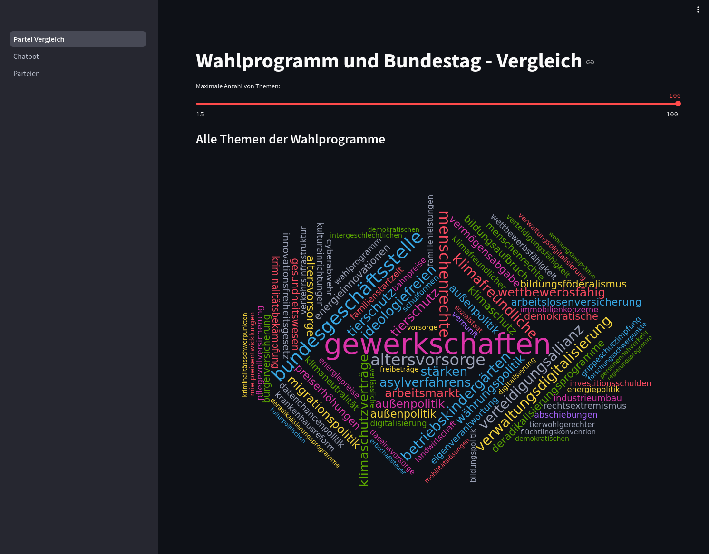

# Website Vorschau



Es wird angenommen, dass dieses Projekt auf dem FH Jupyter Cluster ausgeführt wird, da dieses Projekt ein LLM lokal hostet. 
Die Website an sich kann auf jedem System ausgeführt werden, der Chatbot beötigt aber NVIDA Cuda und einige GB an GPU Speicher. 

# Ordnerstruktur

```bash
.
├── Data # Der Data Ordner beinhaltet Daten aus dem NLP Projekt, dieser wird über Sciebo zur Verfügung gestellt.
│   ├── ....
│   ....
│ 
├── functions.py
├── Partei Vergleich.py
├── pages
│   ├── Chatbot.py
│   └── Parteien.py
├── LLM-Server.sh
└── requirements.txt
```

# Projekt starten
Die beste Möglichkeit das Projekt zu hosten ist mit Visual Studio Code in dem Jupyter Cluster. 


Hierfür zunächst in den Projekt Ordner navigieren, in dem Projekt Order das Terminal Spalten, da zwei Terminal Instanzen benötigt werden. (Für Website Host und vLLM)


## Webseite starten

Zunächst alle Abhängigkeiten installieren

```bash
pip3 install -r requirements.txt
```

```bash
streamlit run Partei\ Vergleich.py
```

Hier kommt der Grund wieso die Website über VSC auf dem Cluster gehostet werden sollte, VSC erkennt den Port den streamlit öffnet und erstellt einen Link über den die Website erreichbar ist.


Mit einen Klick auf "Open in Browser" öffnet sich die Website und ist nahezu komplett nutzbar. 

## LLM Hosten

Hierfür zunächst zurück in das VSC Fenster gehen und das zweite Terminal benutzten.

Um das LLM zu hosten kommt das Projekt mit einem Skript. 
Das Skript erstellt ein venv, installiert vLLM und hostet das Modell.
Das starten wird einige Minuten dauern. 

```bash 
chmod +x LLM-Server.sh
./LLM-Server.sh
```

Wenn die Website und das LLM laufen, sehen die Terminals so aus.


